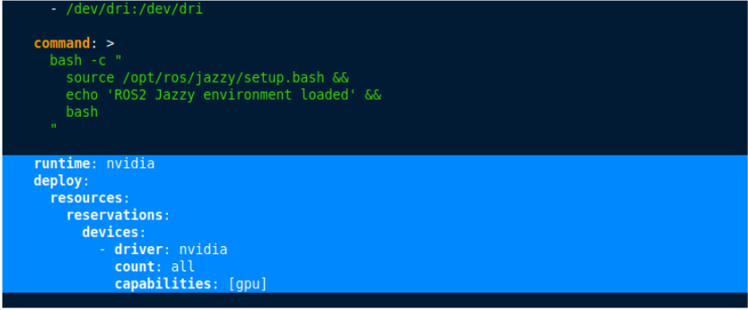

# PETER_SIMULATION
Simulación de P.E.T.E.R para paper en el semillero de neurocontrol motor.

Nota: Si se va a subir algo en la carpeta de "Repository", se debe hacer directamente desde GitHub debido a especificaciones del `.gitignore`

## SHORTCUTS

[Link compartido del documento](https://uao-my.sharepoint.com/:f:/g/personal/samuel_carlos_uao_edu_co/EsC_FuYnnO5Jhq126P5lIN4BZYnXlXEZ-dV7QUh0XY8A0w?e=DaVQGd) 

[Link de bitácoras semanales](https://uao-my.sharepoint.com/:f:/g/personal/samuel_carlos_uao_edu_co/Erp2ENIspZxNgMopqcnKfAUBfoev0AsDrE33obHUKmgpDg?e=dBNilw) 

[Link del Latex](https://www.overleaf.com/project/67e093f33865a616a2b0bc91)

## ¿Cómo usar el repositorio?

### VIDEO TUTORIAL

 <a href="https://www.youtube.com/watch?v=xyDA1aFvYTs">
  
</a>


## Configuración Inicial
1. **DESCARGAR LOS REQUISITOS PARA EL TUTORIAL DE DOCKER**: 
   [Click aquí para descargar Docker Harmonic](https://www.mediafire.com/file/ss6lf31t07wkcio/Docker_harmonic.zip/file)
   
2. **IMPORTANTE**: Hacer el tutorial de docker antes de usar el repositorio

## TUTORIAL DE DOCKER:


0. **Requisitos previos**
Asegúrate de tener instalado Docker y, si los vas a usar, los drivers de NVIDIA.

1. **Descarga y descompresión**
Descomprime el .zip `[Docker Harmonic]`

2. **Acceder a la carpeta Docker**
Entra en la carpeta `Docker` y abre una terminal.

3. **Definir el nombre del contenedor**
Ejecuta el siguiente comando, reemplazando `docker_simulator` con el nombre que desees:

```bash
export CONTAINER_NAME=docker_simulator
```

### 4. Configuración de NVIDIA (Opcional)
Si vas a usar los drivers de NVIDIA, ejecuta:

```bash
docker compose up -d
```

Si **no** vas a usar los drivers de NVIDIA:
1. Abre el archivo `compose.yaml`
2. Elimina la línea correspondiente a NVIDIA:



3. Guarda los cambios
4. Ejecuta:

```bash
docker compose up -d
```

5. **Verificar la creación del contenedor**
Para asegurarte de que el contenedor se creó correctamente, ejecuta:

```bash
docker ps -a
```

Verifica que el contenedor que creaste aparezca en la lista.

6. **Iniciar el contenedor**
Para iniciar el contenedor, ejecuta:

```bash
docker start docker_simulator
```

7. **Acceder al contenedor**
Para entrar al contenedor, usa:

```bash
docker attach docker_simulator
```

8. Continuar con el tutorial de GitHub

## TUTORIAL DE GITHUB:
  
1. **Ir dentro del docker folder**:
    ```bash
    cd Docker_harmonic/docker_simulator/
    ```
    
2. **Clonar el repositorio**: Este comando copiará los archivos del repositorio en el pc:
    ```bash
    git clone git@github.com:sammcar/PETER_SIMULATION.git
    ```
    Si te aparece "Permission Denied (Publickey)", tienes que seguir el tutorial para usar SSH 

### En caso de hacer cambios en el equipo local (hacer un commit)

1. **Ir a la carpeta raiz para asegurar de hacer un commit de todo**: 
    ```bash
    cd PETER_SIMULATION
    ```
    
2. **Actualizar el contenido**: 
    ```bash
    git pull origin main
    ```
    
3. **Verificar los archivos que creaste/modificaste**:
    ```bash
    git status
    ```
    
4. **Añadir los archivos que creaste/modificaste**:
    ```bash
    git add .
    ```
    
5. **Hacer el commit**:
    ```bash
    git commit -m "<mensaje>"
    ```
    
6. **Hacer el push**:
    ```bash
    git push origin main
    ```


### Solución para problemas de autenticación sin SSH

Si enfrentas problemas de autenticación, puedes ejecutar los siguientes comandos para asegurarte de estar utilizando la autenticación SSH:
1.  Asegúrate de haber configurado tu clave SSH correctamente. Sigue el siguiente [video tutorial](https://youtu.be/XvtizBx7AFA) para corregir este error. 

2. Establecer la URL remota:
   ```bash
   git remote set-url git@github.com:sammcar/PETER_SIMULATION.git
   ```

3. Agregar el origen remoto (si es necesario):
   ```bash
   git remote add origin git@github.com:sammcar/PETER_SIMULATION.git
   ```
---


## Uso de ramas (Branches) para trabajar en paralelo:

Para trabajar de forma óptima y organizada en el Paper, se vuelve necesario el uso de las ramas:

### 1. Creación de una nueva rama

Debes crear una nueva rama para empezar con el uso del trabajo en paralelo. Para ello, debes usar el siguiente comando (En este caso `nombre de la rama` será tu nombre):

```bash
git branch <nombre de la rama>
```

Ejemplo:

```bash
git branch dieguito
```

Ahora, para cambiar a tu rama de desarrollo deberás usar el siguiente comando(En este caso `nombre de la rama` será tu nombre):

```bash
git switch <nombre de la rama>
```

Ejemplo:

```bash
git switch dieguito
```

### 2. Hacer cambios y subirlos

Una vez que hayas hecho un cambio en tu rama, lo siguiente será subir los cambios que hiciste (en tu rama) al repositorio:
Nota: Los cambios se harán únicamente en tu rama, no en la rama principal del repositorio

**Añadir los cambios y hacer un commit**:
   ```bash
   git add .
   git commit -m "Descripción del cambio"
   ```
**Subir los cambios a tu rama del repositorio**:
   ```bash
   git push origin <nombre-rama>
   ```


---
---


# **Comandos de ROS**

## **1. Compilar y configurar el entorno**
```bash
colcon build && source install/setup.bash
```

---

## **2. Lanzar visualización en RViz**
```bash
ros2 launch peter_robot display.launch.py
```

---

## **3. Lanzar simulación en Gazebo**
```bash
ros2 launch peter_robot gazebo.launch.py
```

---

## **4. Lanzar Gazebo con un mundo específico**
```bash
ros2 launch peter_robot gazebo.launch.py world_name:=(nombre_del_mundo_sin_extension)
```

### **Mundos disponibles**
- `depot` → entorno industrial  
- `terrain` → mapa de Dieguito  
- `empty` → entorno clásico  
- `contextos` → mapa con estímulos fieles a la simulación  
- `fabrica` → mapa con iluminación industrial diferente  

> **Nota:** Si no se especifica un mundo, se cargará `empty` por defecto.

---

## **5. Control del robot**

### **Teleoperado**
En otra terminal:
```bash
ros2 run peter_robot peter_teleop_keyboard
```

### **Control con la red neuronal**
En otra terminal:
```bash
ros2 run peter_robot red_neuronal
```

---

## **6. Visualización de gráficas**
Puedes correrlo en otra terminal mientras la simulación está activa:
```bash
ros2 launch peter_robot graficas_launch.py
```

---

## **7. Herramientas de visualización en Gazebo**
Para ver **LIDAR**, **superficies de contacto** y otras herramientas dentro de Gazebo, se recomienda revisar el video **"Resultados Red"** ubicado en:  
```
Samuel/Entregas Pasadas
```
en **OneDrive**.


