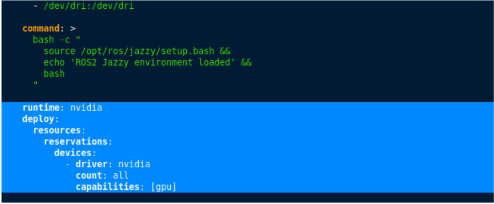
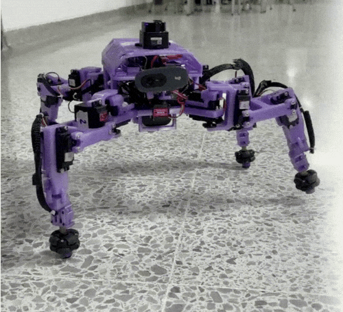
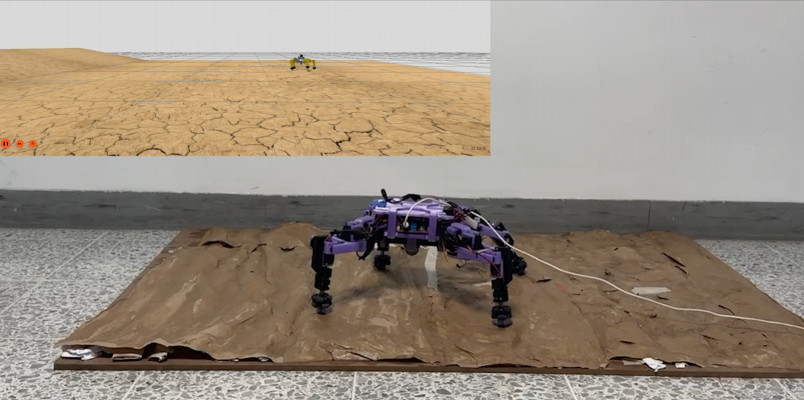
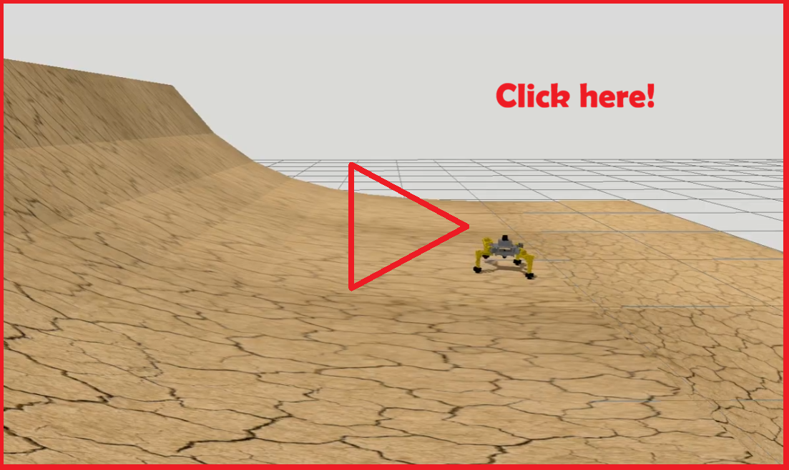

# P.E.T.E.R Simulation — Documentación Completa

<!-- METADATOS -->
| Campo | Valor |
|-------|-------|
| **Repositorio** | `sammcar/PETER_SIMULATION` |
| **Repo ID** | `929631572` |
| **Descripción oficial** | Simulación de P.E.T.E.R para paper en el semillero de neurocontrol motor. |
| **Composición por lenguajes** | `[{"name":"Python","percent":96.2},{"name":"C","percent":2.1},{"name":"C++","percent":0.7},{"name":"Cython","percent":0.7},{"name":"Fortran","percent":0.2},{"name":"PowerShell","percent":0.1}]` |

---

## Descripción técnica del proyecto

El repositorio `sammcar/PETER_SIMULATION` contiene un workspace ROS 2 (`ros2_ws/`) con dos paquetes principales: `peter_robot` (ament_python, ~96 % Python) que encapsula el modelo URDF/xacro, los mundos de Gazebo (`.sdf`/`.world`), los archivos de lanzamiento (`launch/*.py`), las mallas (`meshes/`), los modelos SDF adicionales y los scripts de control y red neuronal; y `peter_robot_c` (ament_cmake, con un nodo C++ `red_cpp`), que comparte la misma estructura de recursos. El proyecto depende de **ROS 2 Humble** con **Gazebo Fortress** (paquetes `ros_gz_sim`, `ros_gz_bridge`, `ros_gz_image`, `ros_gz_interfaces`), no presenta uso explícito de GPU/CUDA en el código fuente, pero se recomienda habilitar soporte NVIDIA por si se requiere en futuras extensiones. El repo es mayoritariamente Python (96.2 %) y usa el stack de build `colcon` con `ament_python` para `peter_robot` y `ament_cmake` para `peter_robot_c`; la versión/distro ROS 2 se detecta como **Humble** a partir del uso de `ros_gz_sim`, `ros_gz_bridge` y el esquema de mensajes `gz.msgs.*` observado en los launch files y archivos de configuración de bridges.

Este README documenta: prerrequisitos del entorno Windows + WSL2 + WSLg + Docker; pasos completos de clonado y posicionamiento en la rama `Deiv`; construcción con `colcon` adaptada a Humble; uso de Docker con soporte NVIDIA opcional; comandos para limpiar `build/install/log`; ejecución de Gazebo con GUI vía WSLg (preferente) o headless; y sección de diagnóstico con 14 problemas comunes. Se prioriza WSLg para la GUI; VNC/X11 se documentan solo como respaldo.

---

## Índice

1. [Archivos relevantes del repositorio](#1-archivos-relevantes-del-repositorio)
2. [Prerrequisitos y verificación del entorno](#2-prerrequisitos-y-verificación-del-entorno)
3. [Clonar el repositorio y usar la rama Deiv](#3-clonar-el-repositorio-y-usar-la-rama-deiv)
4. [Inspeccionar los paquetes](#4-inspeccionar-los-paquetes)
5. [Construir con colcon (sin Docker)](#5-construir-con-colcon-sin-docker)
6. [Limpiar y reconstruir desde cero](#6-limpiar-y-reconstruir-desde-cero)
7. [Dockerfile sugerido](#7-dockerfile-sugerido)
8. [docker-compose.yml sugerido](#8-docker-composeyml-sugerido)
9. [Construir y ejecutar con Docker](#9-construir-y-ejecutar-con-docker)
10. [Entrar al contenedor y construir dentro](#10-entrar-al-contenedor-y-construir-dentro)
11. [Lanzar la simulación](#11-lanzar-la-simulación)
12. [Verificación de la simulación](#12-verificación-de-la-simulación)
13. [Habilitación de GPU en WSL / Docker](#13-habilitación-de-gpu-en-wsl--docker)
14. [Problemas de GUI y soluciones (WSLg primero)](#14-problemas-de-gui-y-soluciones-wslg-primero)
15. [Diagnóstico y resolución de problemas](#15-diagnóstico-y-resolución-de-problemas)
16. [Comandos de verificación rápida (10 comandos)](#16-comandos-de-verificación-rápida-10-comandos)
17. [Referencias útiles](#17-referencias-útiles)

---

## 1. Archivos relevantes del repositorio

| Ruta relativa | Descripción |
|---|---|
| `ros2_ws/src/peter_robot/package.xml` | Declaración del paquete Python `peter_robot` (ament_python, ROS 2, formato 3). |
| `ros2_ws/src/peter_robot/setup.py` | Configura entry points, instala launch, urdf, meshes, worlds, models y config. |
| `ros2_ws/src/peter_robot/setup.cfg` | Configura el directorio de scripts para desarrollo (`lib/peter_robot`). |
| `ros2_ws/src/peter_robot/launch/gazebo.launch.py` | Launch principal: arranca Gazebo Fortress, spawna el robot y carga los controladores. |
| `ros2_ws/src/peter_robot/launch/display.launch.py` | Launch de RViz2 para visualización del modelo URDF. |
| `ros2_ws/src/peter_robot/launch/graficas.launch.py` | Launch de RViz2 + PlotJuggler para gráficas en tiempo real. |
| `ros2_ws/src/peter_robot/worlds/empty.world` | Mundo vacío (plano) por defecto para la simulación. |
| `ros2_ws/src/peter_robot/worlds/depot.sdf` | Entorno industrial (almacén con obstáculos). |
| `ros2_ws/src/peter_robot/worlds/terrain.world` | Mapa de terreno con superficies irregulares. |
| `ros2_ws/src/peter_robot/worlds/contextos.world` | Mapa con estímulos (azul, rojo, obstáculo) fieles a la simulación del paper. |
| `ros2_ws/src/peter_robot/worlds/fabrica.sdf` | Entorno industrial con iluminación diferente. |
| `ros2_ws/src/peter_robot/urdf/peter.urdf` | Modelo URDF base del robot hexápodo P.E.T.E.R. |
| `ros2_ws/src/peter_robot/urdf/peter.urdf.xacro` | Xacro principal que integra URDF, colores y plugins de control y sensores. |
| `ros2_ws/src/peter_robot/urdf/peter_control_plugin.xacro` | Xacro con plugins `gz_ros2_control`, LiDAR, IMU, contacto y cámara. |
| `ros2_ws/src/peter_robot/urdf/peter_colors.xacro` | Xacro con materiales y colores para Gazebo. |
| `ros2_ws/src/peter_robot/meshes/` | Mallas 3D (STL/DAE) del robot usadas por el URDF. |
| `ros2_ws/src/peter_robot/models/` | Modelos SDF de estímulos (esferas roja, azul) que se spawnan en la simulación. |
| `ros2_ws/src/peter_robot/config/gz_bridge.yaml` | Mapa de topics ROS ↔ Gazebo: clock, tf, joints, scan, IMU, cámara, bumpers. |
| `ros2_ws/src/peter_robot/config/peter_joint_controller.yaml` | Config `ros2_control`: joint_state_broadcaster, ForwardCommandController de articulaciones, velocidad y cabeza. |
| `ros2_ws/src/peter_robot/src/peter_controller.py` | Nodo ROS 2 con cinemática inversa y control de marcha del robot. |
| `ros2_ws/src/peter_robot/src/red_neuronal.py` | Nodo ROS 2 con la red neuronal de locomoción (numpy, rclpy). |
| `ros2_ws/src/peter_robot/src/peter_teleop_keyboard.py` | Nodo de teleoperación por teclado. |
| `ros2_ws/src/peter_robot/src/camera_node.py` | Nodo de procesamiento de la cámara RGB. |
| `ros2_ws/src/peter_robot/src/plotter.py` | Nodo para graficar actividad neuronal. |
| `ros2_ws/src/peter_robot_c/package.xml` | Declaración del paquete CMake `peter_robot_c` (ament_cmake, ROS 2). |
| `ros2_ws/src/peter_robot_c/CMakeLists.txt` | Build del ejecutable C++ `red_cpp` e instalación de recursos compartidos. |
| `ros2_ws/src/peter_robot_c/src/red_cpp.cpp` | Implementación C++ de la red neuronal (nodo alternativo al Python). |
| `ros2_ws/README.txt` | Instrucciones originales breves: colcon build, launch, mundos disponibles y herramientas. |
| `Findings/` | Resultados experimentales (imágenes de ganglios, locomoción, múltiples estímulos). |
| `Repository/` | Workspaces históricos, implementación en robot real, recursos gráficos del paper. |

> **Nota:** No se encontró `Dockerfile`, `docker-compose.yml`, `requirements.txt`, `environment.yml` ni workflows de GitHub Actions/CI en el repositorio. Se proveen versiones sugeridas en las secciones 7 y 8.

---

## 2. Prerrequisitos y verificación del entorno

### Versiones recomendadas (justificación)

| Componente | Versión recomendada | Justificación |
|---|---|---|
| **ROS 2** | **Humble Hawksbill** (LTS) | Los paquetes `ros_gz_sim`, `ros_gz_bridge`, `ros_gz_interfaces` y `ros2_control` detectados corresponden al stack disponible en Humble. Es la distribución LTS vigente más compatible con Gazebo Fortress. |
| **Gazebo** | **Fortress** (Gazebo 6) | Los topics usan el prefijo `gz.msgs.*` del nuevo stack Gazebo, soportado en Humble mediante `ros-humble-ros-gz*`. |
| **Ubuntu** | **22.04 Jammy** | Plataforma de soporte oficial para ROS 2 Humble. |
| **Docker** | ≥ 24.0 | Compatibilidad con NVIDIA Container Toolkit y BuildKit. |
| **NVIDIA Driver (host)** | ≥ 525 | Requerido para pasar GPU al contenedor vía `--gpus all` desde WSL. |
| **WSL2 / WSLg** | WSL 2 con kernel ≥ 5.15 | WSLg provee un servidor Wayland/X integrado; no requiere VcXsrv ni VNC. |

### Comandos de verificación previos

```bash
# 1. Verificar versión de WSL y distribución activa
wsl -l -v

# 2. Verificar kernel y Ubuntu dentro de WSL
uname -a
lsb_release -a

# 3. Verificar Docker instalado y ejecutándose
docker --version
docker info

# 4. Verificar integración NVIDIA en WSL
nvidia-smi

# 5. Verificar NVIDIA Container Toolkit
docker run --rm --gpus all nvidia/cuda:12.1.0-base-ubuntu22.04 nvidia-smi

# 6. Verificar variable de display para WSLg
echo $DISPLAY
echo $WAYLAND_DISPLAY

# 7. Verificar que WSLg provee socket X/Wayland
ls /tmp/.X11-unix/
ls $XDG_RUNTIME_DIR/wayland-0 2>/dev/null || echo "Wayland socket no encontrado"

# 8. Verificar Git
git --version

# 9. Verificar Python y pip
python3 --version && pip3 --version

# 10. Verificar colcon (si se construye fuera de Docker)
colcon version-check || pip3 install colcon-common-extensions
```

---

## 3. Clonar el repositorio y usar la rama Deiv

### 3.1 Clonar el repositorio

```bash
git clone https://github.com/sammcar/PETER_SIMULATION.git
cd PETER_SIMULATION
```

### 3.2 Crear o usar la rama Deiv

```bash
# Opción A: La rama Deiv ya existe en el repositorio remoto
git fetch origin
git checkout -b Deiv origin/Deiv

# Si ya tienes la rama local:
git checkout Deiv

# Opción B: La rama Deiv NO existe aún; crearla desde main
git checkout main
git pull origin main
git checkout -b Deiv
# Realiza tus cambios y luego: git push origin Deiv
```

> ⚠️ **NUNCA hagas commits o push directamente a `main`.** Todo el trabajo de desarrollo va en la rama `Deiv`.

### 3.3 Verificar rama activa

```bash
git branch           # Debe mostrar: * Deiv
git log --oneline -5
```

---

## 4. Inspeccionar los paquetes

```bash
# Listar todos los package.xml del workspace
find ros2_ws/src -name "package.xml" | sort

# Ver nombres de paquetes
grep -r "<name>" ros2_ws/src/*/package.xml

# Listar todos los launch files
find ros2_ws/src -name "*.launch.py" -o -name "*.launch.xml" -o -name "*.launch" | sort

# Listar mundos disponibles
find ros2_ws/src -name "*.world" -o -name "*.sdf" | grep -v models | sort

# Listar archivos URDF/xacro
find ros2_ws/src -name "*.urdf" -o -name "*.urdf.xacro" -o -name "*.xacro" | sort

# Ver estructura completa del workspace
find ros2_ws/src -maxdepth 3 -type d | sort
```

---

## 5. Construir con colcon (sin Docker)

### 5.1 Instalar dependencias del sistema (Ubuntu 22.04 / WSL)

```bash
# Añadir repositorio ROS 2
sudo apt update && sudo apt install -y curl gnupg lsb-release
sudo curl -sSL https://raw.githubusercontent.com/ros/rosdistro/master/ros.key \
  -o /usr/share/keyrings/ros-archive-keyring.gpg
echo "deb [arch=$(dpkg --print-architecture) signed-by=/usr/share/keyrings/ros-archive-keyring.gpg] \
  http://packages.ros.org/ros2/ubuntu $(lsb_release -cs) main" \
  | sudo tee /etc/apt/sources.list.d/ros2.list

# Instalar ROS 2 Humble + Gazebo Fortress + herramientas
sudo apt update
sudo apt install -y \
  ros-humble-desktop \
  ros-humble-ros-gz \
  ros-humble-ros-gz-bridge \
  ros-humble-ros-gz-image \
  ros-humble-ros-gz-sim \
  ros-humble-ros2-control \
  ros-humble-ros2-controllers \
  ros-humble-gz-ros2-control \
  ros-humble-xacro \
  ros-humble-robot-state-publisher \
  ros-humble-plotjuggler-ros \
  python3-colcon-common-extensions \
  python3-rosdep \
  python3-pip

# Dependencias Python del proyecto
pip3 install numpy matplotlib scipy
```

### 5.2 Inicializar rosdep

```bash
sudo rosdep init || true
rosdep update
```

### 5.3 Instalar dependencias con rosdep

```bash
cd ~/PETER_SIMULATION/ros2_ws
rosdep install --from-paths src --ignore-src -r -y
```

### 5.4 Source del entorno base y compilar

```bash
source /opt/ros/humble/setup.bash

cd ~/PETER_SIMULATION/ros2_ws

# Build estándar
colcon build

# Build con symlinks (recomendado para desarrollo: cambios en src se reflejan sin recompilar)
colcon build --symlink-install

# Build solo un paquete específico
colcon build --symlink-install --packages-select peter_robot

# Build con argumentos CMake (modo Release)
colcon build --symlink-install \
  --cmake-args -DCMAKE_BUILD_TYPE=Release

# Build con salida en pantalla (útil para depurar errores)
colcon build --symlink-install --event-handlers console_direct+
```

### 5.5 Hacer source del workspace compilado

```bash
source ~/PETER_SIMULATION/ros2_ws/install/setup.bash
```

> 💡 Agrega este source a tu `~/.bashrc` para no repetirlo en cada sesión:
> ```bash
> echo "source ~/PETER_SIMULATION/ros2_ws/install/setup.bash" >> ~/.bashrc
> source ~/.bashrc
> ```

---

## 6. Limpiar y reconstruir desde cero

> ⚠️ **Advertencia:** Los siguientes comandos eliminan permanentemente `build/`, `install/` y `log/`. Asegúrate de no tener trabajo sin guardar en esas rutas.

```bash
cd ~/PETER_SIMULATION/ros2_ws

# Eliminar carpetas generadas por colcon
rm -rf build/ install/ log/

# Verificar eliminación
ls -la

# Reconstruir desde cero
source /opt/ros/humble/setup.bash
colcon build --symlink-install
source install/setup.bash
```

### Limpiar imágenes y volúmenes Docker

```bash
# Eliminar contenedores detenidos
docker container prune -f

# Eliminar imagen construida localmente
docker rmi peter_sim:local

# Limpiar todo (imágenes sin uso, volúmenes, caché de build)
docker system prune -af --volumes
```

---

## 7. Dockerfile sugerido

> El repositorio **no incluye un Dockerfile**. Se provee el siguiente, compatible con **ROS 2 Humble + Gazebo Fortress + soporte NVIDIA opcional**. Guárdalo como `Dockerfile` en la raíz del repo.

```dockerfile
# syntax=docker/dockerfile:1
# ============================================================
# Dockerfile sugerido para PETER_SIMULATION
# Base: ROS 2 Humble + Gazebo Fortress + soporte NVIDIA
# Plataforma: Ubuntu 22.04 (Jammy)
# ============================================================

ARG ROS_DISTRO=humble
FROM osrf/ros:${ROS_DISTRO}-desktop AS base

LABEL maintainer="samm.car23@gmail.com"
LABEL description="Simulación P.E.T.E.R — ROS 2 Humble + Gazebo Fortress"

ENV DEBIAN_FRONTEND=noninteractive \
    ROS_DISTRO=humble \
    LANG=C.UTF-8 \
    LC_ALL=C.UTF-8

# Soporte NVIDIA (el driver reside en el host Windows/WSL)
ENV NVIDIA_VISIBLE_DEVICES=all \
    NVIDIA_DRIVER_CAPABILITIES=all

RUN apt-get update && apt-get install -y --no-install-recommends \
    git curl wget gnupg lsb-release ca-certificates \
    python3-pip python3-colcon-common-extensions python3-rosdep \
    ros-${ROS_DISTRO}-ros-gz \
    ros-${ROS_DISTRO}-ros-gz-bridge \
    ros-${ROS_DISTRO}-ros-gz-image \
    ros-${ROS_DISTRO}-ros-gz-sim \
    ros-${ROS_DISTRO}-ros-gz-interfaces \
    ros-${ROS_DISTRO}-ros2-control \
    ros-${ROS_DISTRO}-ros2-controllers \
    ros-${ROS_DISTRO}-gz-ros2-control \
    ros-${ROS_DISTRO}-xacro \
    ros-${ROS_DISTRO}-robot-state-publisher \
    ros-${ROS_DISTRO}-joint-state-publisher \
    ros-${ROS_DISTRO}-plotjuggler-ros \
    ros-${ROS_DISTRO}-tf2-tools \
    libgl1-mesa-glx libgl1-mesa-dri x11-apps mesa-utils \
    python3-numpy python3-matplotlib python3-scipy \
  && rm -rf /var/lib/apt/lists/*

RUN rosdep init || true && rosdep update

WORKDIR /ros2_ws
COPY ros2_ws/src ./src

RUN . /opt/ros/${ROS_DISTRO}/setup.sh && \
    rosdep install --from-paths src --ignore-src -r -y

RUN . /opt/ros/${ROS_DISTRO}/setup.sh && \
    colcon build --symlink-install \
      --cmake-args -DCMAKE_BUILD_TYPE=Release

RUN echo "source /opt/ros/${ROS_DISTRO}/setup.bash" >> /root/.bashrc && \
    echo "source /ros2_ws/install/setup.bash" >> /root/.bashrc

COPY docker/entrypoint.sh /entrypoint.sh
RUN chmod +x /entrypoint.sh

ENTRYPOINT ["/entrypoint.sh"]
CMD ["bash"]
```

**Script `docker/entrypoint.sh`** (crear en `docker/entrypoint.sh`):

```bash
#!/bin/bash
set -e
source /opt/ros/humble/setup.bash
source /ros2_ws/install/setup.bash
exec "$@"
```

---

## 8. docker-compose.yml sugerido

```yaml
# docker-compose.yml sugerido para PETER_SIMULATION
version: "3.9"

services:
  peter_sim:
    image: peter_sim:local
    build:
      context: .
      dockerfile: Dockerfile
    container_name: peter_simulation
    network_mode: host
    # ⚠️ --net=host expone todos los puertos del contenedor al host.
    # Úsalo solo en entornos de desarrollo local; reduce el aislamiento de red.
    environment:
      - DISPLAY=${DISPLAY}
      - WAYLAND_DISPLAY=${WAYLAND_DISPLAY}
      - XDG_RUNTIME_DIR=${XDG_RUNTIME_DIR}
      - QT_X11_NO_MITSHM=1
      - ROS_DOMAIN_ID=0
    volumes:
      - /tmp/.X11-unix:/tmp/.X11-unix:rw
      - ${XDG_RUNTIME_DIR}:${XDG_RUNTIME_DIR}
      - ./ros2_ws/src:/ros2_ws/src:ro   # Montaje para desarrollo iterativo
    deploy:
      resources:
        reservations:
          devices:
            - driver: nvidia
              count: all
              capabilities: [gpu]       # Opcional: requiere NVIDIA CTK
    stdin_open: true
    tty: true
    command: >
      bash -c "source /opt/ros/humble/setup.bash &&
               source /ros2_ws/install/setup.bash &&
               ros2 launch peter_robot gazebo.launch.py world_name:=empty"

  # Servicio headless para CI (sin GUI)
  peter_sim_headless:
    image: peter_sim:local
    container_name: peter_simulation_headless
    network_mode: host
    environment:
      - ROS_DOMAIN_ID=0
    command: >
      bash -c "source /opt/ros/humble/setup.bash &&
               source /ros2_ws/install/setup.bash &&
               gz sim -s -r /ros2_ws/install/peter_robot/share/peter_robot/worlds/empty.world"
    profiles:
      - headless
```

---

## 9. Construir y ejecutar con Docker

### 9.1 GUI con WSLg (preferente)

WSLg está integrado en Windows 11 (build ≥ 22000) y en Windows 10 con kernel WSL 2 ≥ 5.10.16. Provee servidor X y Wayland automáticamente — **no se necesita VcXsrv, Xming ni VNC**.

```bash
# Verificar WSLg activo (desde WSL)
echo $DISPLAY           # Debe ser ":0" o similar
ls /tmp/.X11-unix/      # Debe mostrar X0

# Construir la imagen
cd ~/PETER_SIMULATION
docker build -t peter_sim:local .

# Ejecutar con GUI (WSLg)
docker run -it --rm \
  --name peter_sim_gui \
  --network host \
  --env DISPLAY="$DISPLAY" \
  --env WAYLAND_DISPLAY="$WAYLAND_DISPLAY" \
  --env XDG_RUNTIME_DIR="$XDG_RUNTIME_DIR" \
  --env QT_X11_NO_MITSHM=1 \
  --env ROS_DOMAIN_ID=0 \
  --volume /tmp/.X11-unix:/tmp/.X11-unix:rw \
  --volume "${XDG_RUNTIME_DIR}:${XDG_RUNTIME_DIR}" \
  peter_sim:local \
  ros2 launch peter_robot gazebo.launch.py world_name:=empty
```

> **Sobre `--network host`:** ROS 2 DDS necesita red compartida para descubrimiento de nodos. Riesgo: todos los puertos del contenedor quedan expuestos en la red del host. Solo usar en desarrollo local.

#### Alternativa: bind de socket X11 explícito

```bash
xhost +local:docker

docker run -it --rm \
  --name peter_sim_x11 \
  --env DISPLAY="$DISPLAY" \
  --env QT_X11_NO_MITSHM=1 \
  --volume /tmp/.X11-unix:/tmp/.X11-unix:rw \
  --network host \
  peter_sim:local \
  ros2 launch peter_robot gazebo.launch.py world_name:=empty

xhost -local:docker   # Revocar al terminar
```

### 9.2 Modo headless / CI

```bash
docker run -it --rm \
  --name peter_sim_headless \
  --network host \
  --env ROS_DOMAIN_ID=0 \
  peter_sim:local \
  bash -c "source /opt/ros/humble/setup.bash && \
           source /ros2_ws/install/setup.bash && \
           gz sim -s -r /ros2_ws/install/peter_robot/share/peter_robot/worlds/empty.world"
```

> `gz sim -s` arranca solo el servidor de simulación sin cliente gráfico.

### 9.3 Con GPU (NVIDIA)

```bash
# Verificar NVIDIA Container Toolkit
docker run --rm --gpus all nvidia/cuda:12.1.0-base-ubuntu22.04 nvidia-smi

# Ejecutar con GPU habilitada
docker run -it --rm \
  --name peter_sim_gpu \
  --gpus all \
  --env NVIDIA_VISIBLE_DEVICES=all \
  --env NVIDIA_DRIVER_CAPABILITIES=all \
  --env DISPLAY="$DISPLAY" \
  --env QT_X11_NO_MITSHM=1 \
  --volume /tmp/.X11-unix:/tmp/.X11-unix:rw \
  --network host \
  peter_sim:local \
  ros2 launch peter_robot gazebo.launch.py world_name:=depot
```

> **Sobre `--privileged`:** Concede acceso total a dispositivos del host y elimina el aislamiento del contenedor. **Se desaconseja**. Usa `--gpus all` + `--device` para hardware específico. Usa `--privileged` solo como último recurso y con plena conciencia del riesgo de seguridad.

---

## 10. Entrar al contenedor y construir dentro

### Opción A: Imagen auto-suficiente (build en `docker build`)

La imagen del Dockerfile ya compila el workspace. Solo ejecuta `docker run`.

### Opción B: Montar workspace para desarrollo iterativo

```bash
docker run -it --rm \
  --name peter_dev \
  --network host \
  --env DISPLAY="$DISPLAY" \
  --env QT_X11_NO_MITSHM=1 \
  --volume /tmp/.X11-unix:/tmp/.X11-unix:rw \
  --volume ~/PETER_SIMULATION/ros2_ws/src:/ros2_ws/src \
  peter_sim:local \
  bash

# Dentro del contenedor:
source /opt/ros/humble/setup.bash
cd /ros2_ws
colcon build --symlink-install
source install/setup.bash
ros2 launch peter_robot gazebo.launch.py world_name:=empty
```

### Entrar a un contenedor en ejecución

```bash
docker exec -it peter_simulation bash

# Dentro:
source /opt/ros/humble/setup.bash
source /ros2_ws/install/setup.bash
ros2 topic list
```

---

## 11. Lanzar la simulación

### 11.1 Paso a paso completo

```bash
# Terminal 1 — Simulación completa con GUI
source /opt/ros/humble/setup.bash
source ~/PETER_SIMULATION/ros2_ws/install/setup.bash
ros2 launch peter_robot gazebo.launch.py

# Con mundo específico:
ros2 launch peter_robot gazebo.launch.py world_name:=depot
ros2 launch peter_robot gazebo.launch.py world_name:=terrain
ros2 launch peter_robot gazebo.launch.py world_name:=empty
ros2 launch peter_robot gazebo.launch.py world_name:=contextos
ros2 launch peter_robot gazebo.launch.py world_name:=fabrica
```

```bash
# Terminal 2 — Teleoperación por teclado
source /opt/ros/humble/setup.bash
source ~/PETER_SIMULATION/ros2_ws/install/setup.bash
ros2 run peter_robot peter_teleop_keyboard
```

```bash
# Terminal 3 — Red neuronal de locomoción
source /opt/ros/humble/setup.bash
source ~/PETER_SIMULATION/ros2_ws/install/setup.bash
ros2 run peter_robot red_neuronal
```

```bash
# Terminal 4 — Gráficas (RViz + PlotJuggler, con simulación activa)
source /opt/ros/humble/setup.bash
source ~/PETER_SIMULATION/ros2_ws/install/setup.bash
ros2 launch peter_robot graficas.launch.py
```

```bash
# Solo visualización en RViz
ros2 launch peter_robot display.launch.py
```

### 11.2 Mundos disponibles

| `world_name` | Descripción |
|---|---|
| `empty` | Plano vacío (por defecto) |
| `depot` | Entorno industrial (almacén) |
| `terrain` | Mapa de terreno irregular |
| `contextos` | Mapa con estímulos visuales |
| `fabrica` | Entorno industrial con iluminación diferente |

---

## 12. Verificación de la simulación

```bash
# Listar todos los topics activos
ros2 topic list

# Verificar estado de articulaciones
ros2 topic echo /joint_states --once

# Verificar LiDAR
ros2 topic echo /scan --once

# Verificar IMU
ros2 topic echo /imu/data --once

# Verificar cámara
ros2 topic echo /camera/image_raw --once

# Listar topics de Gazebo directamente
gz topic -l

# Listar nodos activos
ros2 node list

# Ver estado de controladores
ros2 control list_controllers

# Verificar procesos de simulación
ps aux | grep -E "gz_sim|ros2|gzserver"

# Consola de logs ROS
ros2 run rqt_console rqt_console
```

---

## 13. Habilitación de GPU en WSL / Docker

### 13.1 Instalar drivers NVIDIA en Windows (host)

1. Descarga e instala el driver NVIDIA para WSL: https://developer.nvidia.com/cuda/wsl
2. **No instales drivers NVIDIA dentro de la distribución WSL** — el driver vive en Windows.

### 13.2 Verificar acceso GPU en WSL

```bash
nvidia-smi
# Debe mostrar la tarjeta NVIDIA del host Windows
```

### 13.3 Instalar NVIDIA Container Toolkit (dentro de WSL / Ubuntu)

```bash
distribution=$(. /etc/os-release; echo $ID$VERSION_ID)
curl -fsSL https://nvidia.github.io/libnvidia-container/gpgkey \
  | sudo gpg --dearmor -o /usr/share/keyrings/nvidia-container-toolkit-keyring.gpg
curl -s -L "https://nvidia.github.io/libnvidia-container/$distribution/libnvidia-container.list" \
  | sed 's#deb https://#deb [signed-by=/usr/share/keyrings/nvidia-container-toolkit-keyring.gpg] https://#g' \
  | sudo tee /etc/apt/sources.list.d/nvidia-container-toolkit.list
sudo apt-get update
sudo apt-get install -y nvidia-container-toolkit
sudo nvidia-ctk runtime configure --runtime=docker
sudo systemctl restart docker

# Verificar
docker run --rm --gpus all nvidia/cuda:12.1.0-base-ubuntu22.04 nvidia-smi
```

### 13.4 Docker Desktop en Windows (alternativa)

1. Docker Desktop → Settings → Resources → WSL Integration: habilita tu distribución.
2. Docker Desktop ≥ 4.3.0 incluye soporte GPU NVIDIA automáticamente si el driver Windows es compatible.
3. Verifica en PowerShell: `docker run --rm --gpus all nvidia/cuda:12.1.0-base-ubuntu22.04 nvidia-smi`

---

## 14. Problemas de GUI y soluciones (WSLg primero)

### WSLg (método preferente, Windows 11 / Windows 10 reciente)

```bash
# Verificar WSLg activo
echo $DISPLAY           # Debe ser :0
ls /tmp/.X11-unix/      # Debe existir X0

# Si DISPLAY está vacío, reiniciar WSL (desde PowerShell en Windows)
wsl --shutdown
wsl
```

**Pasar DISPLAY al contenedor Docker:**

```bash
docker run -it --rm \
  --env DISPLAY="$DISPLAY" \
  --volume /tmp/.X11-unix:/tmp/.X11-unix:rw \
  peter_sim:local \
  ros2 launch peter_robot gazebo.launch.py
```

### Adaptación de scripts legados (asumen servidor X clásico)

```bash
# Si encuentras "export DISPLAY=:1" o llamadas a Xvfb en scripts heredados:
# Reemplaza con:
export DISPLAY=$DISPLAY   # Usa el DISPLAY de WSLg

# Comenta líneas que arranquen Xvfb manualmente:
# Xvfb :1 -screen 0 1280x720x24 &   ← comentar cuando uses WSLg
```

### Respaldo: VNC (si WSLg no está disponible)

```bash
# Instalar VNC dentro del contenedor
apt-get install -y tigervnc-standalone-server
vncserver :1 -geometry 1280x720 -depth 24
export DISPLAY=:1
# Conectar con TigerVNC desde Windows a localhost:5901
```

### Respaldo: X11 con VcXsrv (Windows 10 sin WSLg)

```bash
# 1. Instalar VcXsrv en Windows con "Disable access control"
# 2. En WSL:
export DISPLAY=$(grep nameserver /etc/resolv.conf | awk '{print $2}'):0.0
xhost +
```

---

## 15. Diagnóstico y resolución de problemas

| # | Problema | Causa probable | Solución |
|---|---|---|---|
| 1 | `colcon build` falla: `package not found: ros_gz_sim` | Paquetes `ros-humble-ros-gz*` no instalados | `sudo apt install ros-humble-ros-gz ros-humble-ros-gz-sim ros-humble-ros-gz-bridge` |
| 2 | `xacro.process_file` falla: archivo no encontrado | `peter.urdf.xacro` no instalado tras build | Verifica que `colcon build --symlink-install` terminó sin errores; revisa `install/peter_robot/share/peter_robot/urdf/` |
| 3 | Gazebo abre pero el robot no aparece | `robot_description` no publicado a tiempo | Aumenta el `period` del TimerAction en `gazebo.launch.py` o espera más tiempo |
| 4 | `No module named 'rclpy'` | Workspace no sourced | `source /opt/ros/humble/setup.bash && source install/setup.bash` |
| 5 | GUI de Gazebo no abre en Docker | `DISPLAY` no pasado al contenedor | Agrega `--env DISPLAY=$DISPLAY --volume /tmp/.X11-unix:/tmp/.X11-unix:rw` |
| 6 | `libGL error: No matching fbConfigs` | Mesa/OpenGL no disponible | Instala `libgl1-mesa-glx libgl1-mesa-dri` en el Dockerfile; con GPU usa `--gpus all` |
| 7 | `nvidia-smi` no funciona en WSL | Driver NVIDIA Windows no instalado | Instala driver ≥ 525 desde https://developer.nvidia.com/cuda/wsl |
| 8 | `could not select device driver "nvidia"` | NVIDIA Container Toolkit no instalado | Sigue la sección 13.3 |
| 9 | `[ERROR] ros_gz_bridge: Failed to connect to Gazebo` | Gazebo server no arrancó aún | Espera ~10 s; verifica `ps aux \| grep gz_sim` |
| 10 | Controladores no cargan (`load_controller` timeout) | TimerAction demasiado corto | Aumenta `period` en el launch; verifica `ros2 node list \| grep controller_manager` |
| 11 | `ros2 topic list` devuelve lista vacía | `ROS_DOMAIN_ID` distinto entre terminales | `export ROS_DOMAIN_ID=0` en todas las terminales |
| 12 | `colcon build` muy lento en WSL | I/O lento en carpeta de Windows montada | Mueve el workspace al FS nativo de Linux WSL (`~/`) en vez de `/mnt/c/...` |
| 13 | `peter_teleop_keyboard` no responde | Terminal sin foco o `DISPLAY` incorrecto | Ejecuta en la misma terminal con workspace sourced; asegura foco del teclado |
| 14 | `rosdep install` falla con paquetes Python | Incompatibilidad pip | `pip3 install numpy matplotlib scipy` manualmente; continúa con `--ignore-src` |

### Comandos de diagnóstico adicionales

```bash
# Logs de colcon build
cat log/latest_build/peter_robot/stdout_stderr.log

# Estado de ros2_control
ros2 control list_controllers
ros2 control list_hardware_interfaces

# Árbol de transforms
ros2 run tf2_tools view_frames

# Verificar robot_description publicado
ros2 topic echo /robot_description --once | head -5

# Info del contenedor en ejecución
docker inspect peter_simulation
docker logs peter_simulation
```

---

## 16. Comandos de verificación rápida (10 comandos)

```bash
# 1. Estado de WSL y kernel
wsl -l -v && uname -r

# 2. Docker y daemon
docker --version && docker info | grep -E "Server Version|Runtimes"

# 3. GPU en WSL
nvidia-smi --query-gpu=name,driver_version --format=csv,noheader

# 4. ROS 2 Humble instalado
source /opt/ros/humble/setup.bash && ros2 --version

# 5. Paquetes del workspace
source ~/PETER_SIMULATION/ros2_ws/install/setup.bash && ros2 pkg list | grep peter

# 6. Mundos instalados
ls $(ros2 pkg prefix peter_robot)/share/peter_robot/worlds/

# 7. Gazebo instalado
gz sim --version 2>/dev/null || ign gazebo --version

# 8. DISPLAY/WSLg
echo "DISPLAY=$DISPLAY" && ls /tmp/.X11-unix/ && echo "WSLg OK"

# 9. GPU en Docker
docker run --rm --gpus all nvidia/cuda:12.1.0-base-ubuntu22.04 nvidia-smi

# 10. Topics activos tras launch
ros2 topic list | grep -E "joint_states|scan|imu|cmd_vel|clock"
```

---

## 17. Referencias útiles

| Recurso | URL | Versión recomendada |
|---|---|---|
| ROS 2 Humble (docs oficiales) | https://docs.ros.org/en/humble/ | Humble Hawksbill (LTS hasta mayo 2027) |
| Instalación ROS 2 en Ubuntu | https://docs.ros.org/en/humble/Installation/Ubuntu-Install-Debians.html | — |
| Gazebo Fortress | https://gazebosim.org/docs/fortress | Fortress (LTS, soportado hasta 2026) |
| ros_gz (stack ROS ↔ Gazebo) | https://github.com/gazebosim/ros_gz | branch `humble` |
| gz_ros2_control | https://github.com/ros-controls/gz_ros2_control | branch `humble` |
| NVIDIA Container Toolkit | https://docs.nvidia.com/datacenter/cloud-native/container-toolkit/install-guide.html | ≥ 1.14 |
| Drivers NVIDIA para WSL2 | https://developer.nvidia.com/cuda/wsl | ≥ 525.x |
| WSLg (Microsoft) | https://github.com/microsoft/wslg | Windows build ≥ 22000 |
| Docker Desktop para Windows | https://docs.docker.com/desktop/install/windows-install/ | ≥ 4.3.0 |
| colcon | https://colcon.readthedocs.io/ | latest |

---

> **Generado automáticamente** para el repositorio `sammcar/PETER_SIMULATION` (ID: 929631572).
> Rama de trabajo: `Deiv`. Fecha de generación: mayo 2026.
> ⚠️ **NUNCA modificar la rama `main` directamente. Todo cambio va en la rama `Deiv`.**

---

---

# Contenido original del README

> La sección siguiente preserva las instrucciones originales del repositorio para referencia rápida del equipo.

## SHORTCUTS

[Link compartido del documento](https://uao-my.sharepoint.com/:f:/g/personal/samuel_carlos_uao_edu_co/EsC_FuYnnO5Jhq126P5lIN4BZYnXlXEZ-dV7QUh0XY8A0w?e=DaVQGd)

[Link de bitácoras semanales](https://uao-my.sharepoint.com/:f:/g/personal/samuel_carlos_uao_edu_co/Erp2ENIspZxNgMopqcnKfAUBfoev0AsDrE33obHUKmgpDg?e=dBNilw)

[Link del Latex](https://www.overleaf.com/project/67e093f33865a616a2b0bc91)

Nota: Si se va a subir algo en la carpeta de "Repository", se debe hacer directamente desde GitHub debido a especificaciones del `.gitignore`

## SHORTCUTS

[Link compartido del documento](https://uao-my.sharepoint.com/:f:/g/personal/samuel_carlos_uao_edu_co/EsC_FuYnnO5Jhq126P5lIN4BZYnXlXEZ-dV7QUh0XY8A0w?e=DaVQGd) 

[Link de bitácoras semanales](https://uao-my.sharepoint.com/:f:/g/personal/samuel_carlos_uao_edu_co/Erp2ENIspZxNgMopqcnKfAUBfoev0AsDrE33obHUKmgpDg?e=dBNilw) 

[Link del Latex](https://www.overleaf.com/project/67e093f33865a616a2b0bc91)

## ¿Cómo usar el repositorio?

### VIDEO TUTORIAL

 <a href="https://www.youtube.com/watch?v=xyDA1aFvYTs">
  
</a>


## Configuración Inicial
1. **DESCARGAR LOS REQUISITOS PARA EL TUTORIAL DE DOCKER**: 
   [Click aquí para descargar Docker Harmonic](https://www.mediafire.com/file/zn9p8fz4nifx3c9/Docker_harmonic.zip/file)
   
2. **IMPORTANTE**: Hacer el tutorial de docker antes de usar el repositorio

## TUTORIAL DE DOCKER:


0. **Requisitos previos**
Asegúrate de tener instalado Docker y, si los vas a usar, los drivers de NVIDIA.

1. **Descarga y descompresión**
Descomprime el .zip `[Docker Harmonic]`

2. **Acceder a la carpeta Docker**
Entra en la carpeta `Docker` y abre una terminal.

3. **Definir el nombre del contenedor**
Ejecuta el siguiente comando, reemplazando `docker_simulator` con el nombre que desees:

```bash
export CONTAINER_NAME=docker_simulator
```

### 4. Configuración de NVIDIA (Opcional)
Si vas a usar los drivers de NVIDIA, ejecuta:

```bash
docker compose up -d
```

Si **no** vas a usar los drivers de NVIDIA:
1. Abre el archivo `compose.yaml`
2. Elimina la línea correspondiente a NVIDIA:



3. Guarda los cambios
4. Ejecuta:

```bash
docker compose up -d
```

5. **Verificar la creación del contenedor**
Para asegurarte de que el contenedor se creó correctamente, ejecuta:

```bash
docker ps -a
```

Verifica que el contenedor que creaste aparezca en la lista.

6. **Iniciar el contenedor**
Para iniciar el contenedor, ejecuta:

```bash
docker start docker_simulator
```

7. **Acceder al contenedor**
Para entrar al contenedor, usa:

```bash
docker attach docker_simulator
```

8. Continuar con el tutorial de GitHub

## TUTORIAL DE GITHUB:
  
1. **Ir dentro del docker folder**:
    ```bash
    cd Docker_harmonic/docker_simulator/
    ```
    
2. **Clonar el repositorio**: Este comando copiará los archivos del repositorio en el pc:
    ```bash
    git clone git@github.com:sammcar/PETER_SIMULATION.git
    ```
    Si te aparece "Permission Denied (Publickey)", tienes que seguir el tutorial para usar SSH 

### En caso de hacer cambios en el equipo local (hacer un commit)

1. **Ir a la carpeta raiz para asegurar de hacer un commit de todo**: 
    ```bash
    cd PETER_SIMULATION
    ```
    
2. **Actualizar el contenido**: 
    ```bash
    git pull origin main
    ```
    
3. **Verificar los archivos que creaste/modificaste**:
    ```bash
    git status
    ```
    
4. **Añadir los archivos que creaste/modificaste**:
    ```bash
    git add .
    ```
    
5. **Hacer el commit**:
    ```bash
    git commit -m "<mensaje>"
    ```
    
6. **Hacer el push**:
    ```bash
    git push origin main
    ```


### Solución para problemas de autenticación sin SSH

Si enfrentas problemas de autenticación, puedes ejecutar los siguientes comandos para asegurarte de estar utilizando la autenticación SSH:
1.  Asegúrate de haber configurado tu clave SSH correctamente. Sigue el siguiente [video tutorial](https://youtu.be/XvtizBx7AFA) para corregir este error. 

2. Establecer la URL remota:
   ```bash
   git remote set-url git@github.com:sammcar/PETER_SIMULATION.git
   ```

3. Agregar el origen remoto (si es necesario):
   ```bash
   git remote add origin git@github.com:sammcar/PETER_SIMULATION.git
   ```
---


## Uso de ramas (Branches) para trabajar en paralelo:

Para trabajar de forma óptima y organizada en el Paper, se vuelve necesario el uso de las ramas:

### 1. Creación de una nueva rama

Debes crear una nueva rama para empezar con el uso del trabajo en paralelo. Para ello, debes usar el siguiente comando (En este caso `nombre de la rama` será tu nombre):

```bash
git branch <nombre de la rama>
```

Ejemplo:

```bash
git branch dieguito
```

Ahora, para cambiar a tu rama de desarrollo deberás usar el siguiente comando(En este caso `nombre de la rama` será tu nombre):

```bash
git switch <nombre de la rama>
```

Ejemplo:

```bash
git switch dieguito
```

### 2. Hacer cambios y subirlos

Una vez que hayas hecho un cambio en tu rama, lo siguiente será subir los cambios que hiciste (en tu rama) al repositorio:
Nota: Los cambios se harán únicamente en tu rama, no en la rama principal del repositorio

**Añadir los cambios y hacer un commit**:
   ```bash
   git add .
   git commit -m "Descripción del cambio"
   ```
**Subir los cambios a tu rama del repositorio**:
   ```bash
   git push origin <nombre-rama>
   ```


---
---


# **Comandos de ROS**

## **1. Compilar y configurar el entorno**
```bash
colcon build && source install/setup.bash
```

---

## **2. Lanzar visualización en RViz**
```bash
ros2 launch peter_robot display.launch.py
```

---

## **3. Lanzar simulación en Gazebo**
```bash
ros2 launch peter_robot gazebo.launch.py
```

---

## **4. Lanzar Gazebo con un mundo específico**
```bash
ros2 launch peter_robot gazebo.launch.py world_name:=(nombre_del_mundo_sin_extension)
```

### **Mundos disponibles**
- `depot` → entorno industrial  
- `terrain` → mapa de Dieguito  
- `empty` → entorno clásico  
- `contextos` → mapa con estímulos fieles a la simulación  
- `fabrica` → mapa con iluminación industrial diferente  

> **Nota:** Si no se especifica un mundo, se cargará `empty` por defecto.

---

## **5. Control del robot**

### **Teleoperado**
En otra terminal:
```bash
ros2 run peter_robot peter_teleop_keyboard
```

### **Control con la red neuronal**
En otra terminal:
```bash
ros2 run peter_robot red_neuronal
```

---

## **6. Visualización de gráficas**
Puedes correrlo en otra terminal mientras la simulación está activa:
```bash
ros2 launch peter_robot graficas_launch.py
```

---

## **7. Herramientas de visualización en Gazebo**
Para ver **LIDAR**, **superficies de contacto** y otras herramientas dentro de Gazebo, se recomienda revisar el video **"Resultados Red"** ubicado en:  
```
Samuel/Entregas Pasadas
```
en **OneDrive**.


---
---

# **R E S U L T A D O S**

Se hicieron pruebas de distintos escenarios y se comprobó si el comportamiento de PETER era el esperado. Para detallar gráficas puede dirigirse a la carpeta 
```
/Resultados
```
Adicionalmente, se hizo un video que recopila los resultados grabados, puede ver el video dando click al siguiente video:

## RESULTADOS (VIDEOS)

### Vista Previa a PETER




### Robot físico:
 <a href="https://youtu.be/Bn2_Hg4Rb5k">
  
</a>


### Simulación:
 <a href="https://youtu.be/cwxMxLqk_MA">
  
</a>


