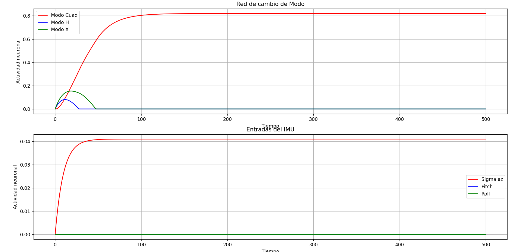

# 📌 README - Red Neuronal para Decisión Locomotora

## 📢 Avance Número 1
Se replantearon los nombres de los estímulos, y se diseñó, desarrolló y simuló una red funcional para la decisión locomotora.

---

## 🎯 Enfoque Ingenieril del Paper
Con el fin de que el paper de la simulación de la araña tenga un enfoque más ingenieril, se propuso replantear los nombres de los estímulos definidos por Sarvestani y su equipo.

Para ello, se analizaron diversas situaciones y problemas en los que la plataforma robótica podría encontrarse, tales como:
- 🌍 **Exploración**
- ⛑️ **Derrumbes**
- 🪨 **Terrenos Rocosos**

A partir de este análisis, los estímulos fueron redefinidos de la siguiente manera:

### 🔹 **Estímulos Redefinidos**
- 🔵 **Estímulo Apetente (AZUL)**
  - Representa un objetivo que la plataforma busca alcanzar.
  - Ejemplos: Una persona atrapada en un derrumbe, una zona de interés en exploración, entre otros.

- 🔴 **Estímulo Hostil (ROJO)**
  - Indica una amenaza para la integridad física del robot.
  - Ejemplos: Un gran agujero en su camino, terrenos peligrosos, etc.

- 🟢 **Obstáculo (VERDE)**
  - Representa un objeto físico intransitable.
  - Ejemplos: Rocas gigantes, paredes, árboles.

---

## 🧠 Nueva Red Neuronal Basada en Datos del IMU

Para mejorar la decisión en el cambio de modo de locomoción, se incorporaron datos del sensor IMU.

### 📡 **Criterios de Cambio de Locomoción**
- 🔄 **Inclinación del IMU**:
  - Si el robot supera los **20°** en **pitch** o **roll**, cambia automáticamente a **modo cuadrúpedo**.
  - Justificación: La tracción de las ruedas no sería suficiente para avanzar de forma óptima.

- 📊 **Variación de la Desviación Estándar de la Aceleración en Z**:
  - Si hay **mucha vibración**, el robot cambia al **modo cuadrúpedo**.
  - Justificación: Un terreno inestable dificulta la locomoción con ruedas.

- 🚦 **Decisión entre Modo H o X**:
  - Si recibe **estímulo azul** → **Modo H**
  - Si recibe **estímulo verde** → **Modo X**

---

## Respuesta de la RED a altas vibraciones:

